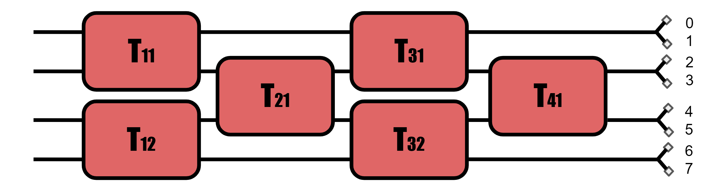
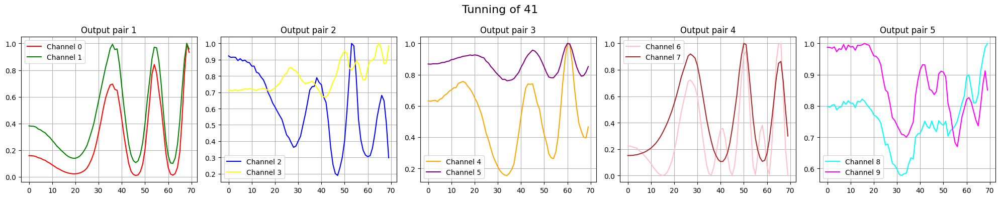

# Documentation for Programmable NanoPhotonics Processor

This repository has codes with plenty of files. The files are used to program the instruments that monitors and control the PNP. There are also function that are used for a better data treatement by using the instruments functions.

# Devices
The devices that are used for this experiments are the folowwing :
## Laser TSL570
This laser from Santec has the advantage of being easy to control and very stable characteristics such as the linewidth or the output amplitude. The laser can also be connected to the NiDAQ for sweeping with the trigger input/ouput function.
## Qontrol ADC/DAC system
The Qontrol ADC/DAC system is from the british company in UK, and the advantage of this system is that it offers the current drivers which is a big advantage avoiding the voltage crosstalk in the PNP.
## HMP4040
The HMP4040 is a good system that is used as a power supply for most of the system such as the Qontrol or any other operating system. There are 4 channels and each can be programmable output up to 32V.
## Arroyo 5240
The Arroyo 5240 is a device allowing to control the temperature with a feedback loop. In this case, I use the Peltier element (TECD2) amd the thermistor (TH10K) from Thorlabs.
## NiDAQ6343 
The NIDAQ 6343 has the advantage of being programmable with the usual DAQ MX software that interfaces with Python. The NiDAQ6343 has an aggregate speed of 500kHz reading speed with 32 Analog input (16 being digital).
# PNP Control
This jupyter notebook uses some function of the function file to characterize the chip by tunning the devices on the PNP. The function file is well documented.